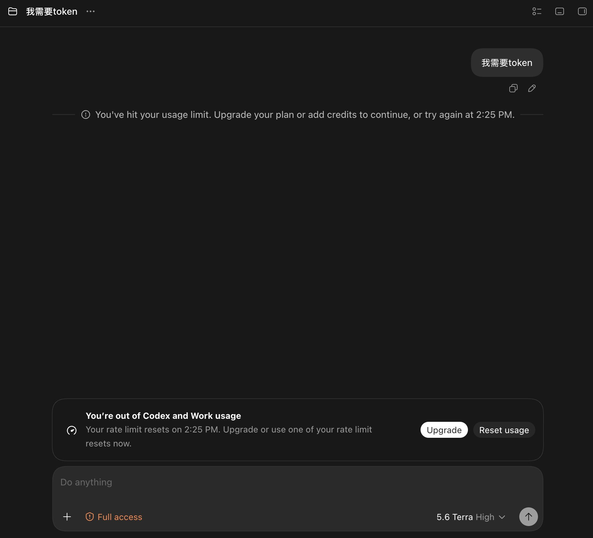
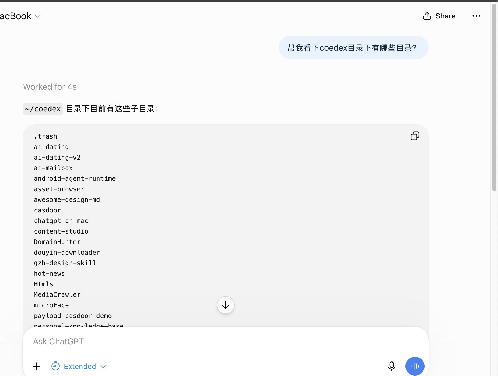
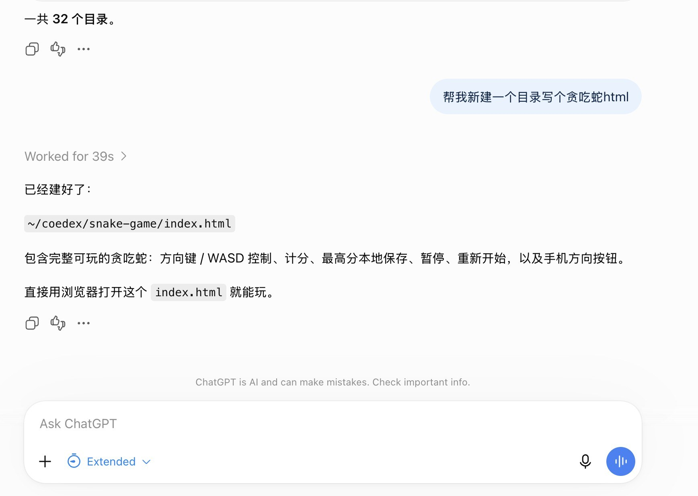

# ChatGPT on Mac

**在 ChatGPT 网页上打一行字，你自己的 Mac 就开始干活。**

不用装客户端，不用开 API，不消耗 API 额度 —— 用的就是你原本每月在付的那个 ChatGPT 网页版。


上面这个游戏，是在 ChatGPT 网页里说了一句「新建个目录，写个贪吃蛇」之后，
它在一台真实的 MacBook 上建目录、写文件、跑起来的结果。那台 Mac 全程没有安装任何软件。

---

## 为什么要折腾这个

Claude Code、Codex CLI 这类工具很好用，但额度烧得飞快。用完就是这样：



而 ChatGPT 网页版的订阅额度，很多人每个月都用不完。

**这个项目就是把两者接起来**：让网页版的 ChatGPT 能够真正操作你的电脑 ——
读代码、改文件、跑测试、装依赖、看日志，就像你自己在终端里敲一样。



这是在 ChatGPT 网页里问「帮我看下 coedex 目录下有哪些目录」，
它真的去那台 Mac 上跑了一遍 —— `Worked for 4s` 是它调用工具的耗时，
下面列出来的是那台电脑上真实存在的目录。



这张是它在执行「建目录 + 写文件」，返回的路径真实存在于那台 Mac 上。

---

## 它是怎么工作的

```
   你在这里打字                  一台便宜的云服务器              你的 Mac
┌─────────────────┐          ┌──────────────────────┐      ┌──────────────┐
│   ChatGPT 网页   │  HTTPS   │   nginx  →  Node 服务 │ SSH  │  命令在这里   │
│                 │ ───────► │                      │ ───► │   真实执行    │
│  「帮我修这个bug」│          │   (本项目的代码)       │      │              │
└─────────────────┘          └──────────────────────┘      └──────────────┘
                                        ▲                          │
                                        └──────────────────────────┘
                                        Mac 主动建立的加密隧道
                                        （所以你家没有公网 IP 也行）
```

**三个关键点，看懂这三条就懂全部了：**

1. **ChatGPT 只会发 HTTPS 请求**，它连不了你的电脑。所以中间必须有一台有公网地址的服务器当"中转站"。
2. **你的 Mac 主动连服务器**，不是反过来。这样你在家、在公司、用手机热点都无所谓 ——
   网络怎么变都能自动重连，而且你的电脑不用暴露任何端口在公网上。
3. **执行靠 macOS 自带的 SSH**（就是「系统设置 → 共享 → 远程登录」那个开关）。
   所以你的 Mac 上**不需要安装任何东西**。

---

## 你需要准备三样东西

| 需要什么 | 说明 | 大概花费 |
|---|---|---|
| **一台 Mac** | 任何 macOS 都行，只需打开「远程登录」开关 | 你已经有了 |
| **一台云服务器（VPS）** | 最便宜的就够。1 核 1G、能装 Node 就行 | 约 ¥100 ~ 300 / 年 |
| **一个域名** | 必须有域名，ChatGPT **不接受 IP 地址**也不接受自签证书 | 约 ¥10 ~ 50 / 年 |
| **ChatGPT 账号** | Plus 或以上（需要能创建 GPTs） | 你已经在付了 |

> 没有 VPS 和域名？阿里云/腾讯云的轻量服务器 + 一个 `.top` / `.xyz` 域名，一年一百块出头能搞定。

---

## 怎么安装

### 方式一：让 AI 帮你装（推荐，不用懂技术）

这个项目就是为了让 AI 能读懂并自动完成部署而写的。

**第一步**：把这个仓库 clone 到本地

```bash
git clone https://github.com/zhanglili31/open-chatgpt-on-mac.git
cd open-chatgpt-on-mac
```

**第二步**：打开任意一个能操作你电脑的 AI（Claude Code / Codex CLI / Cursor / 通义灵码等），
把下面这段话**原样复制**给它：

```
请阅读当前目录下的 AGENTS.md，按照里面的流程帮我完成部署。

我的信息：
- VPS 地址：<填你的服务器 IP>
- VPS root 密码或已配好的 SSH 别名：<填>
- 域名：<填你准备用的域名，比如 mac.你的域名.com>
- 我的 Mac 用户名：<在终端输入 whoami 得到的那个>

请从头到尾做完，遇到需要我操作的地方（比如打开远程登录开关）明确告诉我该点哪里。
```

AI 会自己读 `AGENTS.md`（那是专门写给 AI 看的部署手册），然后一步步做完。

**第三步**：跟着 AI 的指引走。整个过程你只需要做两件事：

1. 在 Mac 上打开「远程登录」开关（系统设置 → 通用 → 共享 → 远程登录）
2. 去域名商那里加一条 A 记录，指向你的 VPS IP

---

### 方式二：自己动手（会用终端的话 10 分钟）

<details>
<summary>点开看详细步骤</summary>

#### 1. Mac 上打开远程登录

系统设置 → 通用 → 共享 → **远程登录** 打开。

验证一下：

```bash
nc -z 127.0.0.1 22 && echo "OK"
```

> 注意：`sudo systemsetup -setremotelogin on` 这条命令在新版 macOS 上会报
> "requires Full Disk Access"，走图形界面反而更简单。

#### 2. 域名解析

去你的域名商后台，加一条 **A 记录**，把 `mac.你的域名.com` 指向 VPS 的 IP。

等几分钟，用 `dig +short mac.你的域名.com @8.8.8.8` 确认解析生效。

#### 3. 把代码部署到 VPS

先改两个默认值：

```bash
# deploy/vps/setup-vps.sh 顶部
DOMAIN="${DOMAIN:-mac.example.com}"       # ← 改成你的域名

# deploy/macbook/setup-tunnel.sh 顶部
VPS_HOST="${VPS_HOST:-203.0.113.10}"      # ← 改成你的 VPS IP
```

然后在本机：

```bash
npm install
bash deploy/sync.sh          # 构建并同步到 VPS
```

VPS 需要先装好 `nginx`、`certbot`、`Node.js 18+`。然后在 **VPS 上**以 root 执行：

```bash
cd /opt/chatgpt-on-mac
MAC_USER=你的Mac用户名 bash deploy/vps/setup-vps.sh
```

脚本会自动建服务账号、生成密钥、申请 HTTPS 证书、配好开机自启。
结束时会打印**两样东西，记下来**：一行公钥，一个 API Token。

#### 4. 授权 VPS 登录你的 Mac

把上一步打印的公钥，在 **Mac 上**执行：

```bash
mkdir -p ~/.ssh && chmod 700 ~/.ssh
echo '这里粘贴刚才打印的那一整行公钥' >> ~/.ssh/authorized_keys
chmod 600 ~/.ssh/authorized_keys
```

#### 5. Mac 建立隧道

```bash
bash deploy/macbook/setup-tunnel.sh
```

这一步会用 macOS 自带的 `launchd` 做保活 —— 合盖睡眠、切 Wi-Fi、服务器重启，
都会自动恢复，不需要装 autossh 之类的东西。

#### 6. 验证

```bash
curl -s https://mac.你的域名.com/health
# 应该返回 {"status":"ok",...}
```

</details>

---

## 接到 ChatGPT 上

装好后，去 ChatGPT 网页：

1. 打开 **https://chatgpt.com/gpts/editor**
2. 切到 **Configure** 标签
3. **Name** 随便填，比如「我的电脑」
4. **Instructions** 粘贴 [`docs/gpt-instructions.md`](docs/gpt-instructions.md) 里的内容
5. 拉到底 → **Create new action**
6. **Schema** 点 **Import from URL**，填 `https://mac.你的域名.com/openapi.yaml`
7. **Authentication** 点齿轮：
   - Authentication Type 选 **API Key**
   - API Key 填部署时拿到的那个 Token
   - Auth Type 选 **Bearer** ← **这里选错会一直报 401**
8. **Privacy policy** 随便填个能打开的网址（ChatGPT 强制要求），填 `https://mac.你的域名.com/health` 就行
9. 右上角 **Create** → 选 **Only me** → 保存

完成后，直接跟它说话就行：

> 看看我 ~/projects 下有哪些项目

> 进 ~/projects/myapp，跑一下测试，挂了的话帮我修

> 把昨天的服务日志里的报错找出来

**第一次调用会弹一个 Allow / Deny 确认框，点 Allow。** 不点它会一直转圈。

---

## 找不到入口？

ChatGPT 新版把 GPTs 藏得很深，侧边栏没有入口，全局搜索也搜不到。记住这两条：

- 网站内：直接打开 **`chatgpt.com/gpts/mine`**
- 更省事：把你那个 GPT 的网址**存成浏览器书签**

**换电脑怎么办？** GPT 存在你的 ChatGPT 账号里，不在电脑上。
换 Windows、换手机、换 iPad，登录同一个账号就能用，操作的还是你那台 Mac。

---

## 它能做什么、不能做什么

### 能做 ✅

git、npm、pnpm、python、node、docker、make、编译、跑测试、起服务、看日志，
以及 ls / cat / grep / find / sed / mkdir / mv / rm 等全部文件操作。
支持多行脚本、管道、重定向。**单次命令实测能跑满 152 秒**（够 `npm install` 和大多数编译了）。

### 不能做 ❌

| 做不了 | 为什么 | 替代方案 |
|---|---|---|
| `sudo` | 非交互 SSH 没有终端，密码输不进去 | 给特定命令配 `NOPASSWD` |
| vim / top 这类 | 需要交互式终端，会返回一堆乱码 | 用 `sed -i` 代替 vim，`ps` 代替 top |
| Mac 睡着时 | 隧道断开，全部报错 | 电池设置里关掉「插电时自动睡眠」 |
| 同时管多台电脑 | 当前设计是一条隧道对一台机器 | 需要改造：每台分配不同端口 |

---

## 安全性

这是一个**能完全控制你电脑的系统**，安全设计说清楚：

| 这一层 | 怎么保护的 |
|---|---|
| 网络传输 | 全程 HTTPS（Let's Encrypt 免费证书），服务只监听本地回环，公网碰不到 |
| 谁能调用 | Bearer Token 认证，定长比较（防止通过响应时间猜 token） |
| 你的 Mac | SSH 只认密钥不认密码；**22 端口不暴露在公网**，只通过隧道绑在服务器的本地回环上 |
| 隧道密钥 | 用 `restrict,port-forwarding` 限制 —— 这把密钥就算泄漏，别人也只能开个转发端口，**不能执行任何命令** |
| 万一被冒充 | 可以配置主机指纹校验，有人在服务器上抢占端口冒充你的 Mac 会被直接拒绝 |
| 出了事能查 | 每一条命令都写进审计日志：时间、命令、工作目录、退出码、耗时 |

### 危险操作会先问你

**这不是白名单，默认放行一切**，只拦下"做错了就回不来"的操作：

```
直接执行，绝不打断              需要你点头确认
  rm -rf node_modules            rm -rf /
  rm -rf dist build              rm -rf ~
  git commit / push              sudo 任何命令
  npm install / build            关机 / 重启
  grep / find / sed              磁盘格式化
  跑测试 / 编译                   curl xxx | bash
                                 git push --force
                                 改 SSH 配置 / 防火墙
```

命中时接口返回一枚一次性令牌，AI 必须先把风险讲给你听、你同意后才能带着令牌重试。
令牌 5 分钟过期，且**和具体那条命令绑定** —— 拿放行 `sudo ls` 的令牌去跑 `sudo rm -rf /` 会被拒绝。

规则都在 [`src/tools/guard.ts`](src/tools/guard.ts)，一条一个正则，想加想删直接改。

---

## 技术栈

Node.js 18+ / TypeScript / [Hono](https://hono.dev) / [ssh2](https://github.com/mscdex/ssh2) / Zod，
零运行时框架负担，VPS 上常驻内存约 60MB。

同时提供两种接入方式，共用同一套后端逻辑：

- **REST API + OpenAPI** → 给 ChatGPT 的 Custom GPT Actions（推荐，写操作没限制）
- **MCP over Streamable HTTP** → 给 ChatGPT 的 Connectors（注意：ChatGPT 对第三方 MCP 的写操作支持会变，不可用就换上面那个）

### 只有三个工具

| 工具 | 干什么 |
|---|---|
| `exec_command` | 执行任意 shell 命令 —— 这一个就覆盖了 99% 的需求 |
| `read_file` | 读文件（走 SFTP，二进制安全，不会乱码） |
| `write_file` | 写文件（走 SFTP，反引号和 `$` 不用转义） |

没有把 `mkdir`、`ls`、`git status` 各封装一个工具 —— 那只会让 AI 的工具列表变长、选错的概率变高。
SSH 本来就是全能执行层。

---

## 目录结构

```
src/
  server.ts            服务入口，REST 与 MCP 挂同一进程
  config.ts            环境变量校验，缺必填项拒绝启动
  logger.ts            运行日志 + 操作审计，自动脱敏
  ssh/
    connection.ts      长连接管理、保活、断线重连、退避
    client.ts          命令执行与 SFTP 读写
  tools/
    exec.ts            exec_command 实现
    files.ts           read_file / write_file 实现
    guard.ts           危险操作规则与确认令牌
  routes/              REST 端点、健康检查、认证中间件
  mcp/                 MCP over Streamable HTTP
deploy/
  sync.sh              构建 + 同步 + 重启
  vps/                 nginx 配置、systemd 服务、一键部署脚本
  macbook/             隧道配置脚本（launchd 保活）
openapi.yaml           给 ChatGPT Actions 用的接口定义
AGENTS.md              给 AI 看的部署手册
```

---

## 常见问题

**Q：会消耗 API 额度吗？**
不会。走的是你 ChatGPT 网页版的订阅，和 API 计费是两码事。

**Q：我家没有公网 IP / 在路由器后面，能用吗？**
能，这正是它的设计目的。你的 Mac 主动往外连服务器，不需要任何端口映射。

**Q：安全吗？会不会被人控制我电脑？**
攻击面只有一个：那个 API Token。别泄漏它。其余环节（SSH 密钥、隧道账号、
主机指纹）都做了最小权限限制，具体见上面的安全性章节。要作废 Token 就改 VPS 上的
`.env` 再重启服务。

**Q：一定要买 VPS 吗？**
是的。ChatGPT 只能发 HTTPS 请求，中间必须有个有公网地址的落点。最便宜的机型就够用。

**Q：Windows / Linux 能用吗？**
这个版本是给 macOS 写的（用了 launchd 保活）。Linux 改成 systemd 服务即可，
核心代码不用动。Windows 需要另外处理（WSL 里理论可行）。

**Q：能同时管好几台电脑吗？**
当前版本不行，一条隧道对一台机器。要做的话：给每台机器分配不同端口，
后端加一个 `target` 参数做路由，改动量不大。

---

## 协议

MIT
